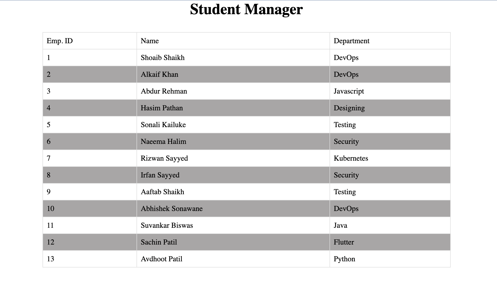

# Student Manager

This project just displays list of Students in the database. *IT DOES NOT PERFORM CRUD OPERATIONS.*



---
| Details | Value |
| --- | --- |
| Language | PHP |
| Database |  MySQL 8.0 |

## How to use this project

1. Create a database instance using MySQL 8.0.
2. Restore the database with the seeder file ```students.sql```.
3. Configure your PHP environment and make sure to install ```mysqli``` extension.
4. Update the MySQL related variables in ```config.php```.
5. Deploy and test your application.